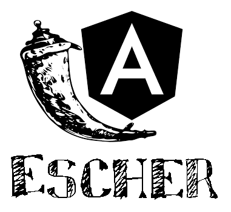

# Escher


## What is the *"Escher"* and what is it for?
**Escher** is a command line tool that lays the foundation for your APP

How to use:

> `python Escher.py <JSON file>`

## What I need?
* JSON file
    - `tables`: Contains the list of tables used in your APP
    - `table`: A table name from your database
    - `field_list`: List of all table field names and their types (See the types below).
    - `pk_field`: Name of the field that is the table's primary key
    - `nested`: Fields that represent a relationship with other tables (dict with field_name and table_name)
    - `Angular`: See the Angular section of this document.
    - `db_type`: Supported types are: DynamoDB, MongoDB, Neo4J, Postgres and SqlServer
    - `db_config`: Configuration information specific to your database (such as user, password...) - If in doubt, use the parameter **--help**
    ```
        python Escher.py --help db_config MongoDB
    ```

    > Field types:
    * `str`
    * `int`
    * `date`
    * `float`
    ---
* Requirements: 

    The _requirements.txt_ file has a lot that you may not need to use:
    - boto3 and botocore - are only for DynamoDB
    - neo4J
    - psycopg2 - Postgres only
    - pymongo
    - pyodbc - SqlServer only
    
    --For Angular, you must install **`font-awesome`**.

## What is produced?

After running Escher with a valid JSON file, a folder with the same name as that file will be created.
Inside, you will find:

**...backend**
* The `model` folder with the definitions of a table and its fields
* The `resource` folder for classes that will respond to requests for multiple records (all*.py files) and for requests with parameters that affect only one record (files *by_id.py)
* The `service` folder with the classes that will take the data from the database to the request classes (/ resource).
* The `tests` folder that will contain the unit tests to check if the services are behaving as expected.

**...frontend**
* `...-item` : Component that shows each record in table.
* `...-list` : The set of components "item" with a search bar above.
* `new-...`: A form component for saving the table record.


## Swagger Documentation
When running the generated APP, you can access the swagger documentation in the browser at
> `http://localhost:5000/docs`

* You can test the GET, POST, PUT and DELETE requests through this page.
* To change the text related to each endpoint, you have to change the docstring of the corresponding method within \ resource
* In these docstrings you can also change the **tags**, which are like \#Read or \#Write to group the endpoints in any way you want.
* You can also customize how swagger handles your APP details, in the `swagger_details` function of app.py.


## Angular pages
Escher produces a draft of your website based on data from the "Angular" key in the JSON file.
<div class="panel panel-danger">

> Angular pages will be made to communicate with the generated backend.


| Angular key | Content       |
|------------:|:--------------|
| title      | Field whose text will appear highlighted for each record |
| label      | Field that will be used to categorize the type of data presented |
| label-colors  | Predefined values of the label field that show each type in a different color (see below). |
| detail     | Field with informational text |
| **image**      | Field with the path to the image that represents the record. |

(*) -- `You must place the images in`
**`assets/img/<table name>`**

<br>


> ### **label-colors**
- `blue` -- Name of the label field that will appear in blue.
- `green` -- Name of the label field that will appear in green.
- `yellow` -- Name of the label field that will appear in yellow.
- `red` -- Name of the label field that will appear in red.

## Arguments
You can generate only your project's frontend or backend
<br>
using the **_--frontend_** or **_--backend_** arguments.
<br>
<br>
It is also possible to create a blank JSON file for use with Escher, <br>
with the **_--new_** option.

---

Thank you for testing this tool. I hope it helps you with your projects!


Julio Cascalles
---
